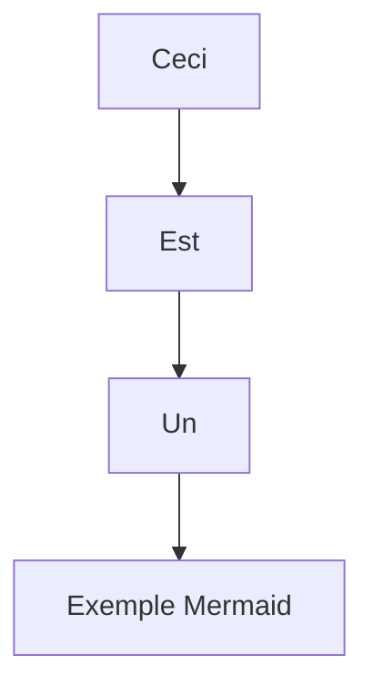
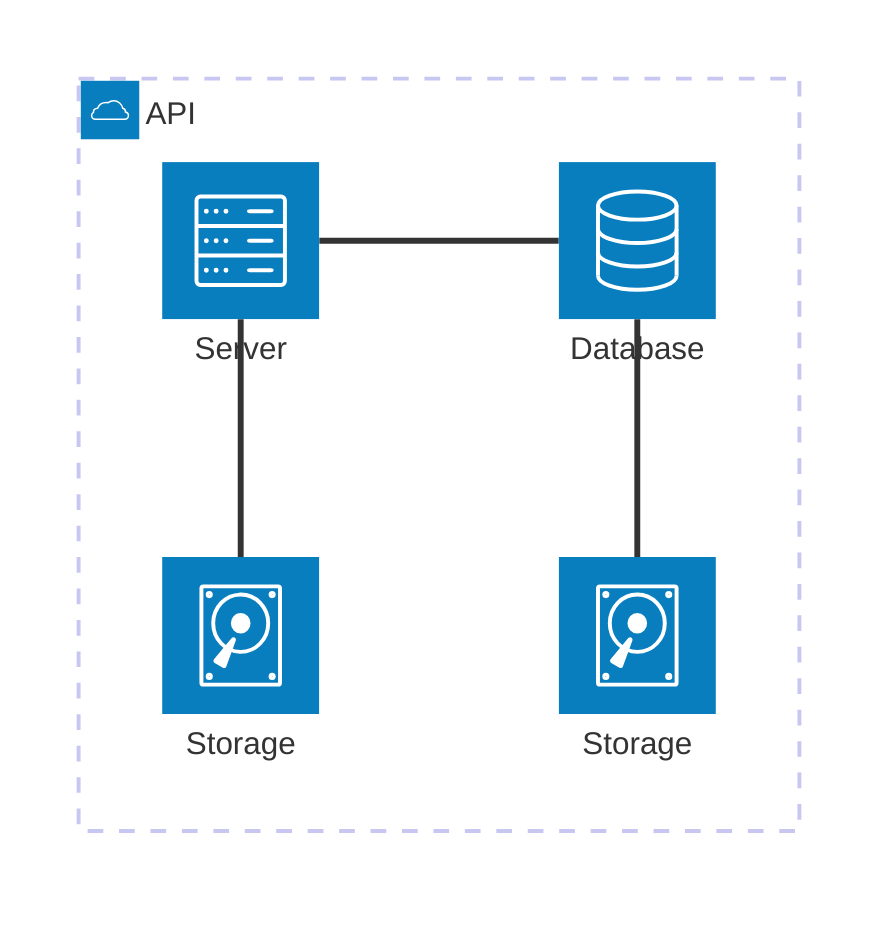
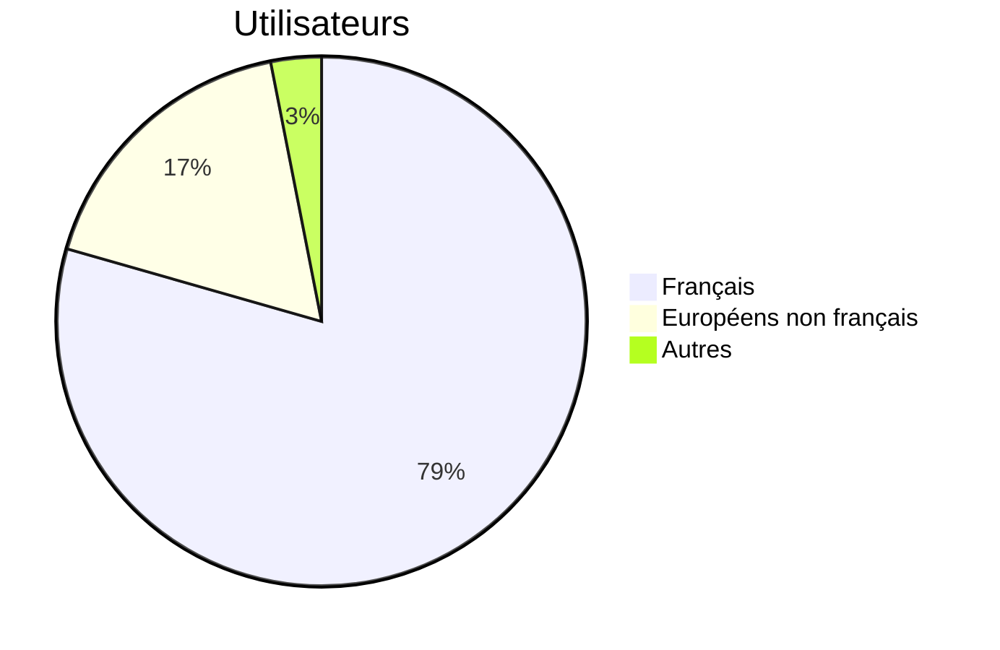

# What is OntoME?
OntoME is an online ontology management environment.

Designed for any object-oriented structured data model, OntoME makes it easy to build, manage and align your ontology and is made to allow you to work collaboratively on the same project.

- You can create a project, manage it by adding members and rights.
- You can create your own namespace and then the classes and properties you need.
- You can align classes and properties with the CIDOC CRM or any other ontology to make them interoperable.
- You can create an application profile containing classes and properties from different namespaces and connect it to your favourite virtual research environment or your home made database.

> The concept of namespaces is at the core of OntoME.

A namespace refers to a set of classes and properties designed to accommodate terms from the same domain. It ensures that all the identifiers within it have unique names so that they can be easily identified.

